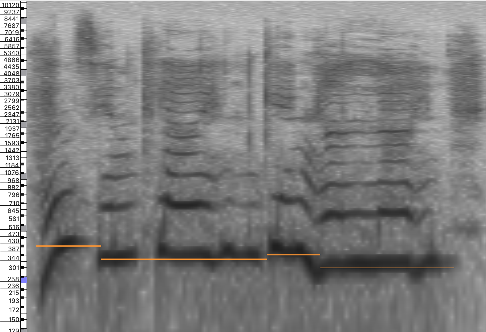

# Singing Voice Transcription Challenge

Train and evaluate *Basic Pitch* on your generated singing transcription dataset!
In this challenge we work with a slighlty modify version of [Basic Pitch](https://github.com/spotify/basic-pitch).
We have trained this model on real singing data.
Can you take the note annotations that we have for that real data; create synthetic singing; train your own model, and match the performance of real data?

## How do I use this dataset for the challenge?
The only thing that you need to do is to put your data under the directory `syntheticdataset` (you have to create it) in the following format:
```bash
src/
README.md
syntheticdataset/
        <some_unique_id_1>/
                    audio.wav
                    score.tsv
        <some_unique_id_2>/
                    audio.wav
                    score.tsv
    ...
```

The dataloader will iterate over the `syntheticdataset` directory, and find within each folder the `audio.wav` and `score.tsv` reference pairs that will be used to train the model.


Whenever you generate your audio, mind that the audio and the score must be well aligned! Check in your audio that the beginning of notes, pitch, etc of the notes adhere to what is on `score.tsv`.
In music note transcription, the margin error allowed usually is as little as **50ms**.

As for training, we took care of the code for that! You just need to run `./experiments_sample.sh`. We deliberately choose a small model as reference for this challenge, as this barely took 20 min to converge in our experiments.

## How do these scores look like?
The music scores that we provide for this challenge are very minimal.
In the provided `tab separated values (.tsv)` files, each line represents a note. The first value is the onset of the note in seconds, the second value its offset time (in seconds as well) and the last value is the pitch encoded as [MIDI values](https://inspiredacoustics.com/en/MIDI_note_numbers_and_center_frequencies).
```tsv
30.609375	31.039583	54.000000
31.069792	31.562500	61.000000
31.600033	31.967741	61.000000
32.100000	32.419824	59.000000
32.450065	33.500065	56.000000
```

Since it is very minimal, feel free to experiment around! use random syllables for each note, create entire lyrics, use different singers, create musical accompaniement for the singing, etc. Whatever you do, remember that the most important is that the singing adheres to the onset-offset-pitch specified in the score.

You can see an example of the annotations overlayed with a log-spectrogram.

Horizontal axis -> Time

Vertical axis -> Frequency (log)

## Ok, we have generated the data, and the model is now training. 
At this point you might be questioning yourself: How will be evaluated the model trained with my generated data?
For that, we will use the reported `COnPOff_f1, COnP_f1, COnf_f1` in tensorboard/wandb, in that order of importance. These stand for:
- COnPOff_f1: Correct onset, pitch, and offset
- COnP_f1: Correct onset and pitch
- COn_f1: Correct onset.
For all of them, the higher the better!
The code to calculate such metrics can be found on: `src/transcription_utils/evaluation.py`

We use two datasets to asses model performance.
One you have at `klangiodataset` already. Whenever training, the mean metrics are reported for this dataset. But it is not the only one! We have a *hidden test set* that we will employ for testing!

## Repository Structure

- `src`: Contains the source code for training the model.
- `src/basic_pitch_model.py`: Basic Pitch CNN architecture.
- `src/basic_pitch_transcriber.py`: Wrapper adapting the model to the OAF training pipeline.
- `src/constants.py`: Shared pipeline and Basic Pitch constants.
- `src/dataloading/`: Dataset loader.
- `src/lightning_module.py`: PyTorch Lightning training module.
- `src/train.py`: Training entry point.
- `src/inference.py`: Transcription inference on arbitrary audio files, it can output midi files.
- `syntheticdataset/`: Synthetic training data.
- `scores`: annotations for real singing. You will take these and generate singing from them!
- `klangiodataset/`: Klangio validation and test data (flat `*.wav` / `*.tsv` pairs).
- `inference_script.sh`: A simplified interface to make transcription inferences with your trained model.

## Training

Training must start from **random initialization**. Pretrained models are not allowed as the goal of the challenge is to find the most effective pipeline to generate singing data for transcription.
See `experiments_example.sh` for the configuration that we used to train the model.

By default, the only checkpoint saved is the one that obtained the best `COnPOff_f1` during evaluation on `klangiodataset`. 
## Inference
In case you want to listen to some examples by yourself
```bash
python -m src.inference \
    --checkpoint-path <ckpt> \
    --input-path /path/to/audio \
    --output-dir predictions
```

## What is that I have to submit? 
1. The code used to generate the singing synthesis
2. The checkpoint of the model that you trained with your synthetic data. Do it with enough time so that we can run the evaluation on our hidden test set!

# Note
If you do not use wandb at all, you might want to delete it from `requirements.txt`.

For each target in `scores`, you can generate more than one pair of `audio.wav` and `score.tsv`:
```bash
src/
README.md
syntheticdataset/
        score_371_singer_A/
                    audio.wav
                    score.tsv
        score_371_singer_B/
                    audio.wav
                    score.tsv
        score_372_singer_A/
                    audio.wav
                    score.tsv
        score_372_singer_B/
                    audio.wav
                    score.tsv
    ...
```
There is no limit to the size of the dataset, so create as much pairs as you need!

We keep the baseline metric values hidden for extra _spiciness_, you will have to wait for the final results to see if your model did as good or better than the one with real singing!
However, we can give you the guidance that `COnP_f1` should be more than `0.15`, otherwise there might be something wrong with the data you created.
